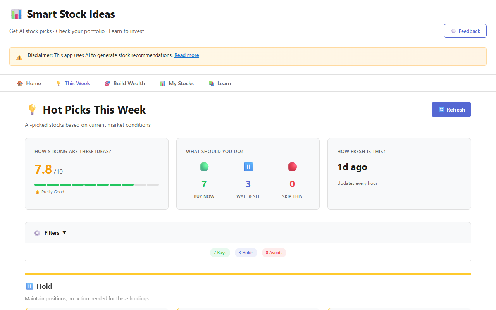
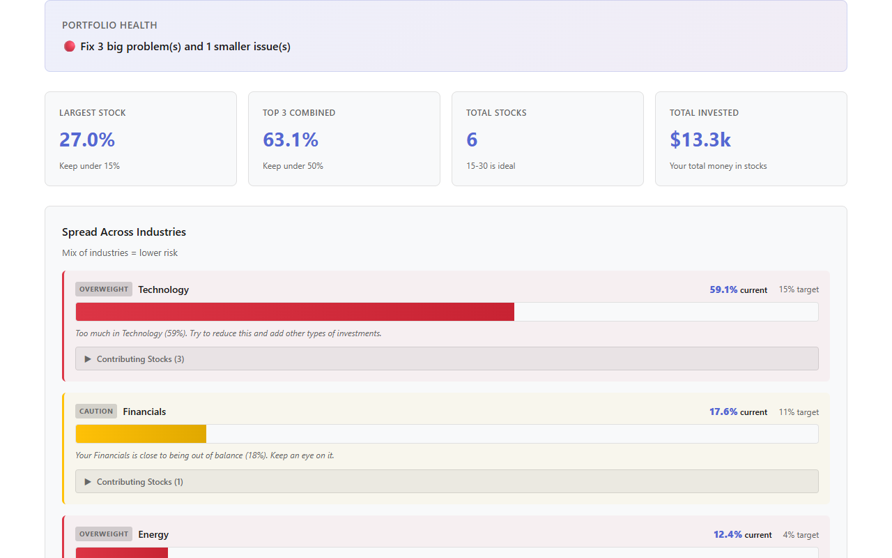
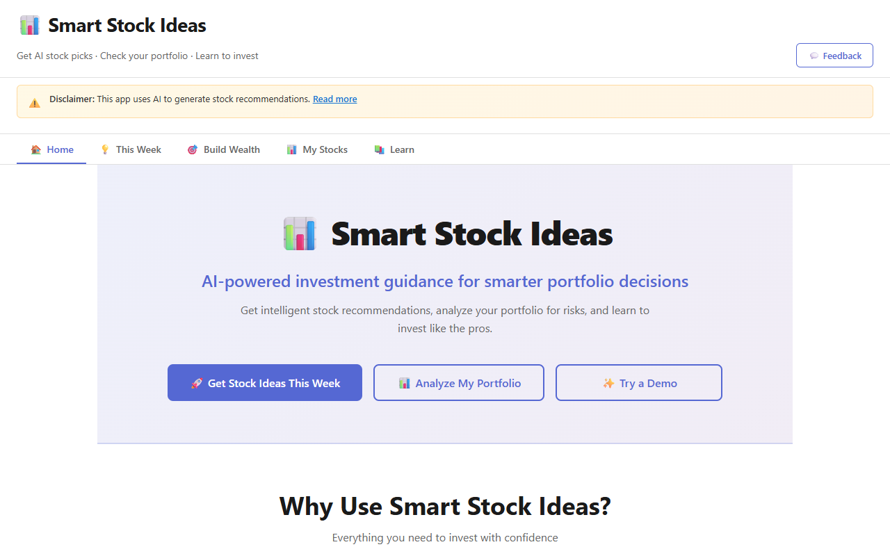
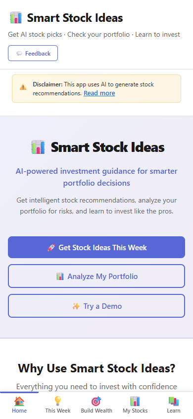

# Portfolio Dashboard

AI-powered portfolio analysis and recommendations for beginner investors. Analyze your stocks, understand sector allocation, get actionable investment advice.


**🔴 Live demo:** [portfolio-builder.up.railway.app](https://portfolio-builder.up.railway.app/) — click **✨ Try a Demo** on the home page to see a full portfolio analysis with sample data, no sign-up needed.

---

## 📸 Screenshots

| AI Stock Picks | Portfolio Risk Analysis |
|---|---|
|  |  |

| Home | Mobile (bottom navigation) |
|---|---|
|  |  |

---

## ⚡ Quick Start

**Just want to see it?** → [Live demo](https://portfolio-builder.up.railway.app/) (✨ Try a Demo button loads a sample portfolio)  
**Want to use the app?** → [User Guide](docs/guides/USER_GUIDE.md)  
**Want to develop?** → [Developer Setup](docs/guides/DEVELOPER_GUIDE.md)  
**Need deployment help?** → [Deployment Guide](docs/guides/DEPLOYMENT.md)

---

## 📚 Documentation

### Getting Started
- [Getting Started Guide](docs/GETTING_STARTED.md) - Installation, setup, first run
- [Architecture Overview](docs/technical/ARCHITECTURE.md) - System design & components
- [Feature Overview](docs/FEATURE_ALIGNMENT.md) - What this app does

### For Users
- [User Guide](docs/guides/USER_GUIDE.md) - How to use the dashboard
- [Understanding Recommendations](docs/guides/USER_GUIDE.md#recommendations) - How the AI works

### For Developers
- [Developer Guide](docs/guides/DEVELOPER_GUIDE.md) - Development setup & contributing
- [API Documentation](docs/technical/API.md) - REST endpoints & integration
- [System Architecture](docs/technical/ARCHITECTURE.md) - Code structure & design decisions

### Design & UX
- [Design System](docs/design/UX_DESIGN.md) - Colors, typography, components
- [WCAG Compliance](docs/design/WCAG_COMPLIANCE.md) - Accessibility standards
- [UX Decisions](docs/design/UX_DESIGN.md) - Design rationale & patterns

### Performance & Deployment
- [Scalability Assessment](docs/performance/SCALABILITY.md) - Azure scaling analysis
- [Deployment Guide](docs/guides/DEPLOYMENT.md) - Deploy to Azure, Docker setup

### Changelog
- [Phase 1 Implementation](docs/changelog/PHASE_1.md) - Initial features & UX fixes
- [Phase 2 Updates](docs/changelog/PHASE_2.md) - Real-time data integration
- [Recent Changes](docs/changelog/RECENT_UPDATES.md) - Latest improvements

---

## 🚀 Features

✅ **Portfolio Analysis** - Upload stocks/ETFs, see sector allocation  
✅ **AI Recommendations** - Groq LLM analyzes your portfolio  
✅ **Real-time Data** - Finnhub stock prices, macro context  
✅ **Beginner-Friendly** - Simplified language, clear guidance  
✅ **Accessible** - WCAG AA compliant, works on all devices  
✅ **Auto-Updated** - Signals refresh hourly with fresh market data  

---

## 🛠️ Tech Stack

**Backend:** Python, Flask, APScheduler, Groq LLM  
**Frontend:** React, Vite, CSS Grid/Flexbox  
**Data:** Finnhub API, FRED, real-time market feeds  
**Infrastructure:** Railway (auto-deploys from `main`), GitHub Actions  

---

## 📋 Prerequisites

- Python 3.10+
- Node.js 18+
- Docker (optional, for containerized deployment)
- Git

---

## ⚙️ Environment Setup

```bash
# Required environment variables
export GROQ_API_KEY="your-key-here"
export FINNHUB_API_KEY="your-key-here"
export FLASK_ENV="development"
```

See [Getting Started Guide](docs/GETTING_STARTED.md) for detailed setup.

---

## 🎯 Common Tasks

| Task | Guide |
|------|-------|
| Run locally | [Developer Guide](docs/guides/DEVELOPER_GUIDE.md) |
| Deploy | Push to `main` — Railway auto-deploys |
| Understand the code | [Architecture](docs/technical/ARCHITECTURE.md) |
| Check API endpoints | [API Docs](docs/technical/API.md) |
| View design system | [Design Guide](docs/design/UX_DESIGN.md) |

---

## 📖 Documentation Structure

```
docs/
├── GETTING_STARTED.md          ← Start here for setup
├── FEATURE_ALIGNMENT.md         ← Feature overview
├── guides/                      ← How-to guides
│   ├── USER_GUIDE.md
│   ├── DEVELOPER_GUIDE.md
│   └── DEPLOYMENT.md
├── technical/                   ← Technical details
│   ├── ARCHITECTURE.md
│   ├── API.md
│   └── SIGNAL_ENGINE_ENHANCEMENTS.md
├── design/                      ← Design & UX
│   └── UX_DESIGN.md
├── performance/                 ← Performance & scaling
│   └── SCALABILITY.md
└── changelog/                   ← Historical records
    └── PHASE_1_IMPLEMENTATION.md
```

---

## 🤝 Contributing

1. Read [Developer Guide](docs/guides/DEVELOPER_GUIDE.md)
2. Fork the repo
3. Create a feature branch
4. Submit a pull request

See [Git Workflow](docs/guides/DEVELOPER_GUIDE.md#git-workflow) for details.

---

## 📞 Support

- **Issues?** Check [Getting Started troubleshooting](docs/GETTING_STARTED.md#troubleshooting)
- **Questions?** See [User Guide FAQ](docs/guides/USER_GUIDE.md#faq)
- **Bug report?** Open an issue on GitHub

---

## 📄 License

MIT License - see LICENSE file for details

---

## 🎓 Learn More

- [How the AI Works](docs/guides/USER_GUIDE.md#how-recommendations-work)
- [Sector Allocation Explained](docs/guides/USER_GUIDE.md#understanding-sectors)
- [Real-time Data Pipeline](docs/technical/ARCHITECTURE.md#data-pipeline)
- [System Architecture](docs/technical/ARCHITECTURE.md)

---

**Last Updated:** 2026-06-08  
**Maintained By:** Development Team  
**Status:** Active Development ✅
